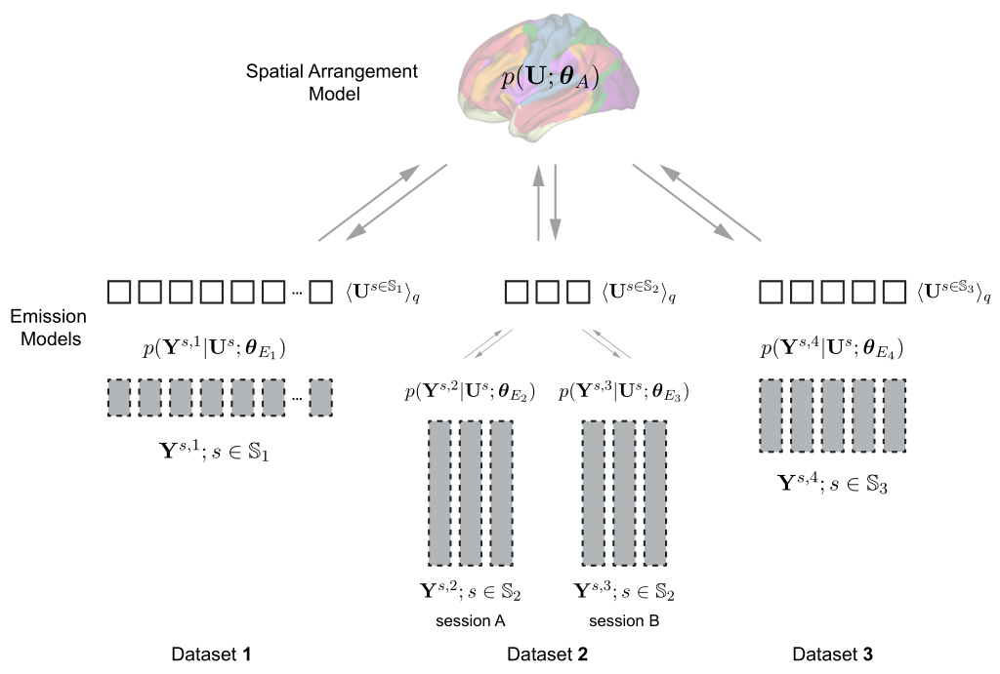

HierarchBayesParcel: A Hierarchical Bayesian Brain Parcellation Framework for fusion of functional imaging datasets
====
Diedrichsen Lab, Western University

This repository hosts the computation models and implementatoin of a hierarchical Bayesian framework
for learning brain organization across a number of different fMRI data that described in this 
[paper](https://www.diedrichsenlab.org/). The framework is partitioned into a spatial *arrangement 
model*, $p(\mathbf{U}|\theta_A)$, the probability of how likely a parcel assignment is within the 
studied population, and a collection of dataset-specific *emission models*, $p(\mathbf{Y}^{s,n}| 
\boldsymbol{\theta}_{En})$, the probability of each observed dataset given the individual brain 
parcellation. This distributed structure allows the parameters of the model to be estimated using a
message-passing algorithm between the different model components. For more details, please checkout 
the preprint.

Reference
------
* Zhi, D., Shahshahani, L., Nettekovena, C., Pinho, A. L. Bzdok, D., Diedrichsen, J., (2023). 
"A hierarchical Bayesian brain parcellation framework for fusion of functional imaging datasets". 
BioRxiv. [[link]](https://www.diedrichsenlab.org/)

Dependencies
------
### Packages
This project depends on several third party libraries, including:

[numpy](https://numpy.org/) (version>=1.22.2)\
[PyTorch](https://pytorch.org/) (version>=1.10.1 + CUDA enabled)\
[nilearn](https://nilearn.github.io/stable/index.html) (version>=0.9.0)\
[nibabel](https://nipy.org/nibabel/) (version>=3.2.0)\
[nitools](https://nitools.readthedocs.io/en/latest/) (version=1.0.0)

### Installations
```
pip install numpy nilearn nibabel neuroimagingtools nilearn
```

Or you can install the package manually from their original binary source as above links.

Once you clone the functional fusion repository, you need to add it to your PYTHONPATH, so you can
import the functionality. Add these lines to your .bash_profile, .bash_rc .zsh_profile file... 

```
PYTHONPATH=<your_repo_absolute_path>:${PYTHONPATH}
export PYTHONPATH
```

Class descriptions
------
### Overview

[comment]: <> (![ScreenShot]&#40;doc/fusion_model.png&#41;)

<p align="center">

</p>

One important barrier in the development of complex models of human brain organization is the lack 
of a large and comprehensive task-based neuro-imaging dataset. Therefore, current atlases of 
functional brain organization are mainly based on single and homogeneous resting-state datasets. 
Here, we propose a hierarchical Bayesian framework that can learn a probabilistically defined brain 
parcellation across numerous task-based and resting-state datasets, exploiting their combined 
strengths. The framework is partitioned into a spatial arrangement model that defines the 
probability of a specific individual brain parcellation, and a set of dataset-specific emission 
models that defines the probability of the observed data given the individual brain organization. 
We show that the framework optimally combines information from different datasets to achieve a new
population-based atlas of the human cerebellum. Furthermore, we demonstrate that, using only 10 min
of individual data, the framework is able to generate individual brain parcellations that outperform
group atlases.


### Arrangement Model
`arrangement_model.py` contains the implementation of different arrangement model classes that 
being used in the framework along with the helper functions. The main active spatial arrangement 
models are:

* `ArrangementModel`: The base class for all arrangement models, which inherits from the `Model`
class.

* `ArrangeIndependent`: The Independent arrangement model, which assumes that the brain locations 
are spatially independent. The current spatial arrangement model being used in the paper.

* `PottsModel`: Potts models (Markov random field on multinomial variable) with K possible states.
Potential function is determined by linkages parameterization is joint between all linkages.

* `cmpRBM`: Convolutional multinomial (categorial) restricted Boltzman machine for learning of 
brain parcellations for probabilistic input. It uses variational stochastic maximum likelihood 
  for the learning


### Emission Model
`emission_model.py` contains the implementation of different emission model classes to calculate 
the data likelihood given the individual brain parcellation. The main active emission models are:

* `EmissionModel`: The base class for all emission models, which inherits from the `Model` class.

* `MixGaussian`: The Gaussian mixture emission model with isotropic noise.

* `MixVMF`: The von Mises-Fisher mixture emission model, which assumes that the data is

### Full Model
`full_model.py` contains the implementation of the `FullMultiModel` class that combines the 
arrangement and emission models. The class have the learning and inference details 
for different arrangment and emission models combination. The main active learning methods are:

* `fit_em_ninits()`: which runs the EM-algorithm on a full model starting with `n_inits` multiple 
random initialization values and escape from local maxima by selecting the model with the highest
likelihood after first few iterations. Check the paper for more mathmatical inference details.

* `fit_sml()`: which runs a stochastic maximum likelihood algorithm on a full model when the 
posterior given the data likelihood and arrangment model parameters is intracted. The emission 
model is still assumed to have E-step and Mstep. The arrangement model is has a postive and
negative phase estep, and a gradient M-step to perform the contrastive divergence algorithm.


Usage
------
This repository hosts the computation models and implementatoin of a hierarchical Bayesian 
parcellation framework to learn probabilistic brain parcellations across a number of different 
fMRI datasets. We treat this repository as a toolbox for the framework, which can be used to and 
callable from other projects. It can and should be used along with the 
[functional fusion](https://github.com/DiedrichsenLab/Functional_Fusion)
reporitory to import the preprocessed data as the input to the framework.

Please find this [project](https://github.com/DiedrichsenLab/FusionModel) to find minimum usage
example of the framework and to reproduce the results in the paper.


License
------
Please find out our development license (MIT) in `LICENSE` file.

Bug reports
------
Please contact Da Zhi at dzhi@uwo.ca if you have any questions about this repository.