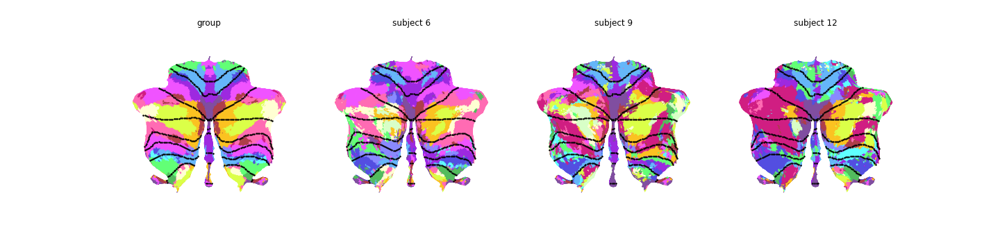

.. _individual_parcellation:

Individual Parcellation Example
===============================

This jupyter notebook is to demenstrate a minimal example for generating individual cerebellar parcellations using individual localizing data. Usually, the individual data are collected within a relatively short period (e.g. 10 mins) or higher signal-to-noise ratio. If we generate individual parcellations based on those data directly using some traditional methods, the results are poor and very noisy. However, in the ``HierarchBayesParcel`` framework, the high-quality individual parcellations are generated using a common group prior and individual localizing data. The main idea of this settings is to "fill-in" the knowledge to those uncertain areas with the group prior. This is a unique advantage that Bayesian model can offer.

To successfully implement this pipeline, some dependent packages are required (see below imports), including `HierarchBayesParcel <https://github.com/DiedrichsenLab/HierarchBayesParcel/tree/main>`_, `Functional_Fusion <https://github.com/DiedrichsenLab/Functional_Fusion>`_, and `nitools <https://github.com/DiedrichsenLab/nitools>`_ repository. See the READ.me in those repos for installation details.

Import all dependencies
-----------------------

.. sourcecode:: python

	import numpy as np
	import torch as pt
	import nibabel as nb
	import nitools as nt
	import matplotlib.pyplot as plt
	import Functional_Fusion.atlas_map as am
	import Functional_Fusion.dataset as ds
	import HierarchBayesParcel.arrangements as ar
	import HierarchBayesParcel.full_model as fm
	from FusionModel.util import plot_data_flat

Step 1: Define the the space in which to generate the individual parcellations
------------------------------------------------------------------------------

This step defines the atlas space (e.g. ``fs32k``, ``SUIT``, ``MNISymC3``, etc) - an atlas in Functional_Fusion defines a specific set of brainlocations (grayordinates) that are being sampled. Both the probabilistic atlas and the data need to be read into this space. 

.. sourcecode:: python

	atlas, _ = am.get_atlas('MNISymC3')

In this example, we generate individual parcellations in ``MNISymC3`` space.

Step 2: Load the probabilistic group atlas
------------------------------------------

**(A) from a *_probseg.nii* file**

First, we can read the probabilistic group atlas ``U`` from a *_probseg.nii* file. The resultant matrix ``U`` has a shape ``(K by P)``, where ``K`` is the number of parcel and ``P`` is the number of brain locations (voxels).

.. sourcecode:: python

	atlas_dir = ':/data/FunctionalFusion/Atlases/tpl-MNI152NLin2009cSymC'
	model_name = f'/atl-Anatom_space-MNI152NLin2009cSymC_probseg.nii'
	U = atlas.read_data(atlas_dir + model_name)
	U = U.T

Replace ``atlas_dir`` + ``model_name`` with your local directory that stores the group atlas *_probseg.nii* file.

**(B) from a pre-trained model**

Alternatively, we can also load the probabilistic group atlas from a pre-trained model. See our `model paper <https://www.biorxiv.org/content/10.1101/2023.05.24.542121v1>`_ for more details.

.. sourcecode:: python

	model_dir = ':/data/Cerebellum/ProbabilisticParcellationModel/Models'
	model_name = f'/Models_03/asym_Md_space-MNISymC3_K-17'
	fname = model_dir + model_name
	U, _ = ar.load_group_parcellation(fname, device='cuda')

The pre-trained models are not publicly available at this moment as we are looking for an efficient data sturcture to host these large amount models.

Step 3: Build an arrangement model
----------------------------------

By using ``HierarchBayesParcel`` computational framework, the parcellations are estimated by training a ``full_model`` class consists of a common **arrangement model** and one or more **emission models** (See this `paper <https://www.biorxiv.org/content/10.1101/2023.05.24.542121v1.abstract>_` for more details). To build the common arrangement model ``ar_model``, user needs to attach a group prior (in log-space) with the desired arrangement model type.
Note, a ``prior_type`` must be given to specify the type of the input ``U``. ``prior_type=prob`` indicates the input ``U`` is marginal probability matrix where columns are sum to 1 (mostly load from a *_probseg.nii* file); ``prior_type=logpi`` means the input ``U`` is already the prior in log-space, usually this ``U`` comes from a pre-trained model.

.. sourcecode:: python

	ar_model = ar.build_arrangement_model(U, prior_type='logpi', atlas=atlas)

Step 4: Build individual localizing data / info
-----------------------------------------------

In this step, we want to load the individual localizing data. As mentioned earlier, the individual localizing data must be in the same ``atlas`` space which we previously defined. Here, we showcase two ways of how to build the input individual data and associated variables for building the emission models.

**(A) build from custom individual data**

First, we assemble all n subjects' data into a single tensor ``data``. The ``data`` is a list of individual localizing data tensor in ``atlas`` space. Each data tensor has a shape of ``num_subj x N x P``, where ``num_subj`` is the number of subjects, ``N`` is the number of conditions, and ``P`` is the number of brain locations (voxels). The ``info`` is a dataframe associated with each subject's data to tell data comes from which session, repeats, and task condition. See an example info structure at `here <_static/sub-02_ses-s1_info-CondHalf.tsv>`_.

.. sourcecode:: python

	data_dir = ':/data/FunctionalFusion/MDTB/derivatives/{0}/data'
	mdtb_dataset = ds.get_dataset_class(':/data/FunctionalFusion','MDTB')
	subj = mdtb_dataset.get_participants().participant_id
	data, info = [], []
	for ses_id in mdtb_dataset.sessions:
		this_data = []
		this_info = []
		info.append(mdtb_dataset.get_info(ses_id=ses_id, type='CondHalf'))
		for i, s in enumerate(subj):
			file_name = f'/{s}_space-{atlas.name}_{ses_id}_CondHalf.dscalar.nii'
			this_data.append(atlas.read_data(data_dir.format(s) + file_name).T)
		data.append(np.stack(this_data))

Now, we assemble condition and partition vectors. ``cond_v`` is a list of 1d array to indicate the condition numbers for dimension ``N``, and ``part_v`` is a list of 1d array to specify the partitioning (runs, or repeated measurement for example) of a data tensor. ``sub_ind`` is to indicate the unique subjects index for each data tensor, repeated subjects across data tensors are theoretically allowed.

.. sourcecode:: python

	cond_v, part_v, sub_ind = [], [], []
	for j, inf in enumerate(info):
		cond_v.append(inf['cond_num_uni'].values.reshape(-1,))
		part_v.append(inf['half'].values.reshape(-1,))
		sub_ind.append(np.arange(0, len(subj)))

Here, the length of the four outputs should have same length. This length is the number of emission models in your training model.

**(B) build from *Functional_fusion* project** (internal use only)

If user intends to use the datasets that already included in our `Functional_Fusion <https://github.com/DiedrichsenLab/Functional_Fusion>`_ project, the required individual data/info can be easily built by using our pre-defined functions as below. This is an exclusive way of building the data for the supported datasets. Please find this `paper <https://www.biorxiv.org/content/10.1101/2023.05.24.542121v1>`_ for a list of supported datasets.

.. sourcecode:: python

	# Load the data into 3d tensor
	data, info, tds = ds.get_dataset(':/data/FunctionalFusion', 'MDTB', atlas=atlas.name, subj=None)

	# Prepare the data into the right format
	tdata, cond_v, part_v, sub_ind = fm.prep_datasets(data, info.sess,
													  info['cond_num_uni'].values,
													  info['half'].values,
													  join_sess=False,
													  join_sess_part=False)

Step 5: Compute the individual parcellations
--------------------------------------------

This step is the main function to generate the individual parcellations, which relies on an established arrangement model ``ar_model``, individual training data ``tdata``, and necessary information to create the emission models ``cond_v``, ``part_v``, ``sub_ind``.

This function: 

* Builds emissions models for each dataset you pass in
* Assembles the arrangement and emission models into a full model
* Trains the emission models on the data (while keeping the arrangement model frozen)
* For each subject, returns the individidual probabilstic parcellation

Note, the function ``get_indiv_parcellation()`` can also learn individual parcellation using a given mean functional response direction :math:`\mathbf{v}_k`. If this is the case, the emission models will freeze the :math:`\mathbf{v}_k` and only estimate concentration parameter :math:`\kappa`. Otherwise, please leave ``Vs=None``, which means the emission models will be trained from randomly initialized parameters.

.. sourcecode:: python

	indiv_par, _, _ = fm.get_indiv_parcellation(ar_model, atlas, tdata, cond_v, part_v, sub_ind, 
												Vs=None, sym_type='asym')

The resultant tensor ``indiv_par`` is the individual parcellations with a shape of ``(n_subj, K, P)``.

Step 6: Visualization - check your results
------------------------------------------

This is the last step, where you can plot / check the individual parcellations and make a direct comparison with the group prior. To support the visualization, we provide a handy function ``plot_multi_flat()`` to plot the individual parcellations in desired space. But with the result ``indiv_par`` from step 5, users are welcome to write plotting scripts on their own usage.

.. sourcecode:: python

	def plot_multi_flat(data, atlas, grid, cmap='tab20b', dtype='label',
						cscale=None, titles=None, colorbar=False,
						save_fig=False):
		""" Plot multiple flatmaps in a grid

		Args:
			data: the input parcellations, shape(N, K, P) where N indicates
				  the number of parcellations, K indicates the number of
				  parcels, and P is the number of vertices.
			atlas: the atlas name used to plot the flatmap
			grid: the grid shape of the subplots
			cmap: the colormap used to plot the flatmap
			dtype: the data type of the input data, 'label' or 'prob'
			cscale: the color scale used to plot the flatmap
			titles: the titles of the subplots
			colorbar: whether to plot the colorbar
			save_fig: whether to save the figure, default format is png

		Returns:
			The plt figure plot
		"""

		if isinstance(data, np.ndarray):
			n_subplots = data.shape[0]
		elif isinstance(data, list):
			n_subplots = len(data)

		if not isinstance(cmap, list):
			cmap = [cmap] * n_subplots

		for i in np.arange(n_subplots):
			plt.subplot(grid[0], grid[1], i + 1)
			plot_data_flat(data[i], atlas,
						   cmap=cmap[i],
						   dtype=dtype,
						   cscale=None,
						   render='matplotlib',
						   colorbar=(i == 0) & colorbar)

			plt.title(titles[i])
			plt.tight_layout()

		if save_fig:
			plt.savefig('/indiv_parcellations.png')

We then plot all 24 subjects' parcellations from ``MDTB`` dataset into one figure.

.. sourcecode:: python

	plt.figure(figsize=(20,20))
	plot_multi_flat(indiv_par.cpu().numpy(), 'MNISymC3', grid=(6, 4),
					cmap='tab20', dtype='prob',
					titles=["subj_{}".format(i+1) for i in range(indiv_par.shape[0])])

Finally, we can plot the group prior as a direct comparison to the individual parcellations.

.. sourcecode:: python

	plt.figure(figsize=(10,10))
	plot_multi_flat(U.unsqueeze(0).cpu().numpy(), 'MNISymC3', grid=(1, 1),
					cmap='tab20', dtype='prob', titles=['group prior'])

