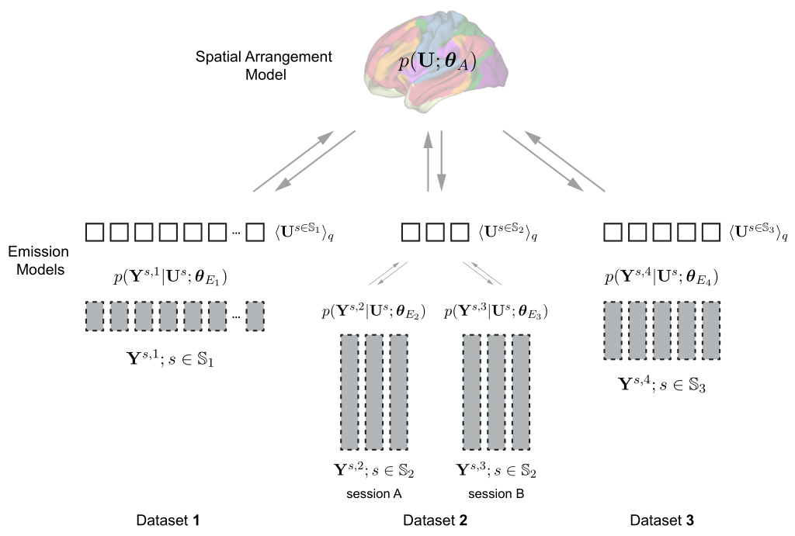

Overview
========

The Hierarchical Bayesian Parcellation framework is designed to 

 can learn a probabilistically defined brain parcellation across numerous task-based and resting-state datasets, exploiting their combined strengths. The framework is partitioned into a spatial arrangement model that defines the probability of a specific individual brain parcellation, and a set of dataset-specific emission models that defines the probability of the observed data given the individual brain organization. We show that the framework optimally combines information from different datasets to achieve a new population-based atlas of the human cerebellum. Furthermore, we demonstrate that, using only 10 min of individual data, the framework is able to generate individual brain parcellations that outperform group atlases.

The hierarchical Bayesian parcellation The code for this framework is openly available. You can use this repository to: 

* Learn new probabilistic brain parcellations across multiple fMRI datasets using other datasets for different brain structures. 
* Use existing probabilistic atlases to obtain individualized brain parcellations for new subjects through the optimal integration of individual localizer data and the group atlas. 

* Learn new probabilistic brain parcellations across multiple fMRI datasets using other datasets for different brain structures. 
* Use existing probabilistic atlases to obtain individualized brain parcellations for new subjects through the optimal integration of individual localizer data and the group atlas. 

Arrangement Model
-----------------

**arrangement_model.py** contains the implementation of different arrangement model classes that being used in the framework along with the helper functions. The main active spatial arrangement models are:

* ``ArrangementModel``: The base class for all arrangement models, which inherits from the ``Model`` class.

* ``ArrangeIndependent``: The Independent arrangement model, which assumes that the brain locations are spatially independent. The current spatial arrangement model being used in the paper.

* ``PottsModel``: Potts models (Markov random field on multinomial variable) with K possible states. Potential function is determined by linkages parameterization is joint between all linkages.

* ``cmpRBM``: Convolutional multinomial (categorial) restricted Boltzman machine for learning of brain parcellations for probabilistic input. It uses variational stochastic maximum likelihood for the learning.

Emission Model
--------------

**emission_model.py** contains the implementation of different emission model classes to calculate the data likelihood given the individual brain parcellation. The main active emission models are:

* ``EmissionModel``: The base class for all emission models, which inherits from the ``Model`` class.

* ``MixGaussian``: The Gaussian mixture emission model with isotropic noise.

* ``MixVMF``: The von Mises-Fisher mixture emission model, which assumes that the data is projected on the sphere with unit length.

Full Model
----------

**full_model.py** contains the implementation of the ``FullMultiModel`` class that combines the arrangement and emission models. The class have the learning and inference details for different arrangment and emission models combination. The main active learning methods are:

* ``fit_em_ninits()``: which runs the EM-algorithm on a full model starting with ``n_inits`` multiple random initialization values and escape from local maxima by selecting the model with the highest likelihood after first few iterations. Check the paper for more mathmatical inference details.

* ``fit_sml()``: which runs a stochastic maximum likelihood algorithm on a full model when the posterior given the data likelihood and arrangment model parameters is intracted. The emission model is still assumed to have E-step and Mstep. The arrangement model is has a postive and negative phase estep, and a gradient M-step to perform the contrastive divergence algorithm.

Scope and related repositories
------------------------------
This repository implements the computational side of the hierarchical Bayesian 
parcellation framework. In the interest of making this toolbox as modular as possible, we do not provide the 
tools to extract the individual subject data in a group atlas space or to project the parcellations back into the volume of the surface. 

For the illustrative examples, we are using the 
[Functional_Fusion](https://github.com/DiedrichsenLab/Functional_Fusion)
repository to import the preprocessed data as the input to the framework.

The analyzes and simulations reported in Zhi et al. (2023), can be replicated using the [FusionModel](https://github.com/DiedrichsenLab/FusionModel) repository. 

License
-------
Please find out our development license (MIT) in ``LICENSE`` file.

Bug reports
-----------
Please contact Da Zhi at dzhi@uwo.ca if you have any questions about this repository.